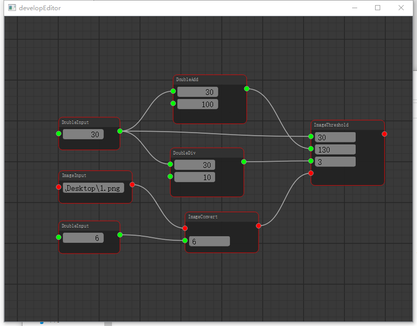

# Vapour
基于Qt与OpenCV的节点式编辑器

希望未来集成建模与shader

## Show

## Features

UI基于Qt的Graphics控件，包含关系为View->Scene->Item

与数据无关，可以自由扩展数据与操作

## TODO

完善析构函数

canCompute的检测

文件序列化与反序列化

历史堆栈

更多的UI组件

更多的节点

右键菜单的内存泄漏

C11新特性的引入

## Release

https://github.com/SoTosorrow/Vapour/releases

## Build

选择编译release模式，在pro文件根据优化的需要添加下面的语句

QMAKE_CXXFLAGS_RELEASE += -O # Release -O

QMAKE_CXXFLAGS_RELEASE += -O1 # Release -O1

QMAKE_CXXFLAGS_RELEASE += -O2 # Release -O2

QMAKE_CXXFLAGS_RELEASE += -O3 # Release -O3

（打包输出）取出Release的exe

win中搜索Qt(MinGW) 执行 cd(path)> windeployqt Vapour.exe

增加reply文件到exe所在目录

